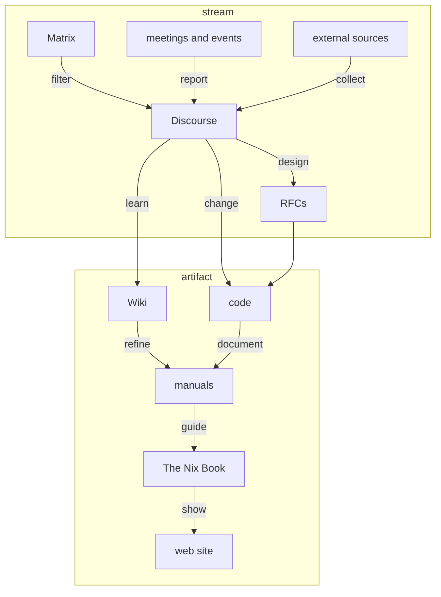

# Contributing to Nix documentation

The Nix Book is a community effort to collect, create, and maintain world-class learning resources for Nix.

We strongly encourage everyone interested to contribute by asking informed questions or directly proposing changes.

Open an issue if you want to clarify something not evident from what is provided in this repository, or if you want to discuss a significant change before starting to work on it.

Make a pull request if you want to introduce an incremental change.
Note our [considerations on licensing and attribution](#licensing-and-attribution).

## You want to learn and use Nix?

This book would not be possible without you.
Try to use it as your primary resource, however incomplete it may appear.

We ask you to liberally open issues and document all problems and questions that arise.
Please also state your learning goals and the paths you have taken so far.

Sharing your first-hand experience is invaluable to better guide our efforts, and will immediately help improve the book for yourself and everyone else.

## You have experience teaching Nix?

You will probably have observed where learners get stuck most often, and which typical needs and questions they have.
You may have your own written notes for classes, trainings, or presentations.

Please share your experience and help us inform the structure and detailed contents of this book.
It would be great if you could contribute examples, wordings, or illustrations that proved helpful to your students.

## You are a domain expert using Nix?

If you are proficient in applying Nix to a domain-specific problem, and want to share your expertise on best practices, please check the table of contents.
Does existing material on your subject meet your standards?
How could we improve it?
Is there a popular application of Nix' capabilities not yet covered?
We would be glad to incorporate your insights.

# Documentation team

## Motivation

To improve the state of affairs with Nix onboarding and documentation, we have to tackle some big issues and work through many small ones:
implement structural changes after gathering the necessary social support;
fix numerous little problems and help people get their contributions merged.

It requires significant time or resources to do this effectively and consistently.
The team is built around that limitation, and therefore organized as a praxicracy:
you are in charge if and only if you get the work done.

The team’s reason to exist is to make that principle discoverable and reproducible by laying groundwork and setting examples.

## Goals

- ease Nix learning, increase onboarding success and user retention
- improve organization of Nix knowledge
- lead, guide, and support community efforts

## Members

- Valentin Gagarin (@fricklerhandwerk) (lead until 2022-10-31)

    Nix documentarian, [Tweag](tweag.io)

- Jörg Thalheim (@Mic92)

    NixOS Wiki maintainer

- Domen Kožar (@domenkozar)

    [nix.dev](http://nix.dev) author, [Cachix](cachix.org)

## Meeting protocol

The team holds bi-weekly meetings on Thursdays 17:30 (Europe/Berlin).
Meetings are announced on the [Discourse community calendar](https://discourse.nixos.org/t/community-calendar/18589).

Meeting agendas are set on [the team's GitHub project board](https://github.com/orgs/NixOS/projects/15) from issues and pull requests.
Pull requests have priority, and authors are invited to the meetings.
Estimated discussion time is annotated for each agenda item and is expected to be followed.

Each meeting begins with determining a scribe to take notes, and a moderator to keep focus and schedule.
Notes are prepared in a [HackMD](https://hackmd.io/) scratchpad, and added to the respective issue or pull request as a comment.

All notes are posted on the [Discourse documentation team category](https://discourse.nixos.org/c/governance/documentation-team/43).

Notes should contain:
- date of meeting
- list of attendees
- links to GitHub comments from agenda items

# Guidelines

Here are values and practical guidelines to go by when contributing.

## Values

### Be kind

Adapted from [Contributor Covenant](contributor-covenant) and [The Carpentries Code of Conduct](carpentries-coc):

- Use welcoming and inclusive language
- Show empathy and respect towards other people
- Be respectful of different viewpoints and experiences
- Give and gracefully accept constructive criticism
- Focus on what is best for the community

[contributor-covenant]: https://github.com/EthicalSource/contributor_covenant/blob/cd7fcf684249786b7f7d47ba49c23a6bcb3233eb/content/version/2/1/code_of_conduct.md?plain=1#L25-L31
[carpentries-coc]: https://github.com/carpentries/docs.carpentries.org/blob/4691971d9f49544054410334140a4fd391a738da/topic_folders/policies/code-of-conduct.md?plain=1#L15-L19

### Be truthful

The only thing more confusing than no documentation is misleading documentation.

#### Use and provide evidence

This book should enable readers to answer all their questions on their own.

Provide [links](#links) to the [online Nix manual][nix-manual] or other resources, if it would help guide readers on their learning journey.
It is explicitly within scope of this project, and encouraged by Nix maintainers, to update or restructure the [Nix manual source code][nix-manual-src] where appropriate, to improve the overall experience.

Similarly, the other information in this repository should enable contributors to answer most of their questions and correct obvious errors on their own, and only then resort to opening issues.

Errors get more obvious if we can measure execution against intent.
Therefore we ask you to always make explicit the motivation behind your proposed changes.

Add references to any relevant resources in commit messages, if it helps understand the reasoning behind a significant change.

[nix-manual]: https://nixos.org/manual/nix/stable/
[nix-manual-src]: https://github.com/NixOS/nix/tree/master/doc/manual

#### Ensure working code samples

Code samples must always be working correctly when run as instructed.
Nix provides us with everything needed to make this happen.

Currently we have no automated tooling in place to assist with this, and pull requests to address that question are very welcome.

### Be concise

> I would have written a shorter letter, but I did not have the time.
>
> — [Blaise Pascal][shorter-letter]

This book is for the readers, and their time and attention is limited.
Take the time to be extraordinarily respectful with their cognitive resources.

You can use diagrams or illustrations to support written descriptions.
[GitHub allows creating Mermaid diagrams within Markdown.][github-mermaid]

The same holds for communication directed to contributors and maintainers:
This is a public project, and many people will read what you write.
Use this leverage with care.

[shorter-letter]: https://en.m.wikiquote.org/w/index.php?title=Blaise_Pascal&oldid=2978584#Quotes
[github-mermaid]: https://github.blog/2022-02-14-include-diagrams-markdown-files-mermaid/

## Guides

### How to contribute effectively?

Different audiences require different levels of sophistication, and both readers' and contributors' available time and expertise varies widely.

The following diagram shows a pipeline for contributions to learning material and documentation.
Use it to decide where to best put the results of your efforts, depending on how much time you can spend on refining them to get accepted.

Communication platforms are distinguished by mode of interaction:
- append to streams
  - amount of infomation grows without bounds
  - only recent items are relevant
- change artifacts
  - amount of information is strictly bounded
  - all items are relevant

Arrows point towards
- decreasing rate of change
- increasing public visibility
- increasing amount of scrutiny.

Arrows indicate possibilities to promote existing material to more prominent and more easily discoverable locations.



- Matrix

  Use Matrix for casual communication.

  The documentation team frequents the [Nix\* Documentation] room.

  Old messages are extremely improbable to be read by anyone.
  Feel free to post what you have found valuable on [Discourse][discourse].

- meetings and events

  Check the [Discourse community calendar][calendar] for real-time events.

  The documentation team holds regular meetings and posts meeting notes in the [Documentation][docs] category.

- external sources

  The Internet is full of helpful resources concerning Nix.
  Feel free to share what you have found valuable on Discourse in the [Links][links] category.

- Discourse

  [Discourse][discourse] is the central community hub.
  This is the place for your questions, suggestions, and discussion.

  The documentation team monitors the [Documentation][docs] category.

  Old threads and especially posts in long threads are improbable to be read by many people.
  Feel free to write down what you have learned in a [NixOS Wiki][wiki] article, or update an existing article.

- Wiki

  [NixOS Wiki][wiki] is a collection of interlinked guides to solve well-known problems.
  It is collectively edited by the community.

  The Wiki is a dumping ground for Nix knowledge.
  Its purpose is to quickly and conveniently collect insights and make them readily available when needed.
  It covers a broad range of topics, is only loosely organized, and does not impose quality standards.

  The documentation team monitors changes to maintain an overview of topics of interest and prevent vandalism.

  You can help with
  - improving discoverability by adding categorization.
  - clarifying articles and correcting errors
  - migrating information to other resources.

  Guidelines for migration:
  - Nix interaction: [Nix manual][nix-manual]
  - Language-specific build instructions: [Nixpkgs manual][nixpkgs-manual]
  - Package, service, or hardware configuration: [NixOS manual][nixos-manual]
  - Ecosystem overview and best practices: [The Nix Book][book]

- manuals

  The manuals for
  - [Nix][nix-manual]
  - [Nixpkgs][nixpkgs-manual]
  - [NixOS][nixos-manual]

  are primarily reference documentation, specifying interfaces and behavior.
  They also show example interactions to show how to use its components, and explain mechanisms where necessary.

  The documentation team assists contributors to get their changes to the manuals merged.

- The Nix Book

  The book's purpose is to guide newcomers by teaching essential Nix knowledge, show best practices, and help orient users in the Nix ecosystem.
  It goes into breadth, not depth.

  The documentation team maintains The Nix Book as editors.

- web site

  The Nix project web site is [nixos.org][www].
  Web site contents that concern learning Nix should reference or include material from The Nix Book.

  The [Nix markting team][marketing] is responsible for the web site, and the documentation team assists with maintaining contents related to onboarding.

[matrix]: https://app.element.io/#/room/#docs:nixos.org
[calendar]: https://discourse.nixos.org/t/community-calendar/18589
[discourse]: https://discourse.nixos.org/
[wiki]: https://nixos.wiki/
[howto]: https://discourse.nixos.org/c/howto/15
[docs]: https://discourse.nixos.org/c/dev/documentation/25
[links]: https://discourse.nixos.org/c/links/12
[nix]: https://github.com/NixOS/nix
[nixpkgs]: https://github.com/NixOS/nixpkgs
[book]: https://github.com/NixOS/nix-book
[marketing]: https://nixos.org/community/teams/marketing.html
[www]: https://nixos.org

### How to help immediately?

  You can always help out by
  - converting [Howto] posts can be to Wiki pages.
    Add a link from the thread to the page to guide readers.

### File organization

```
├── README.md       | project front page on GitHub
├── CONTRIBUTING.md | this file
├── LICENSE.md      | license information
├── resources.md    | categorized collection of existing learning resources
└── contents        | book contents
```

### Licensing and attribution

When opening pull requests with your own contributions, you agree to licensing your work under [CC-BY-SA 4.0][cc-by-sa].
You will be considered co-author of this book, as recorded by version history.

When adding material by third parties, make sure it has a matching license that permits this.
In that case, [unambiguously](#links) state source, authors, and license.
Also [add the original author as co-author][github-multiple-authors] to the respective change, so we can track authorship through version history.

Notify the authors *before* using their work.

[cc-by-sa]: https://creativecommons.org/licenses/by-sa/4.0/
[github-multiple-authors]: https://docs.github.com/en/pull-requests/committing-changes-to-your-project/creating-and-editing-commits/creating-a-commit-with-multiple-authors

### Links

Unless explicitly required to point to the latest version of an external resource, all references should be [permanent links][permalink].

Many web services offer permalinks.
Examples:
- [GitHub URLs to specific commits][github-permalink]
- [Wikipedia URLs to specific page versions][wikipedia-permalink]
- [Internet Archive "Save Page Now" for persisting web pages][internet-archive-save]

[permalink]: https://en.m.wikipedia.org/wiki/Permalink
[github-permalink]: https://docs.github.com/en/repositories/working-with-files/using-files/getting-permanent-links-to-files
[wikipedia-permalink]: https://en.m.wikipedia.org/wiki/Wikipedia:Linking_to_Wikipedia#Permanent_links_to_old_versions_of_pages
[internet-archive-save]: https://web.archive.org/save

### Markdown

Write one sentence per line.
This makes it easier to manage changes.
The rule is unambiguous and does not require tooling support to be applied easily.

[Here is a discussion of different line wrapping styles.][markdown-wrapping-styles]

Use [reference links][reference-link] to keep the plain text readable.
Collect links at the end of each section, which are delimited by headings.

[markdown-wrapping-styles]: https://web.archive.org/web/20220519121408/https://mtsknn.fi/blog/4-1-wrapping-styles-for-markdown-prose-and-code-comments/
[reference-link]: https://github.github.com/gfm/#reference-link
