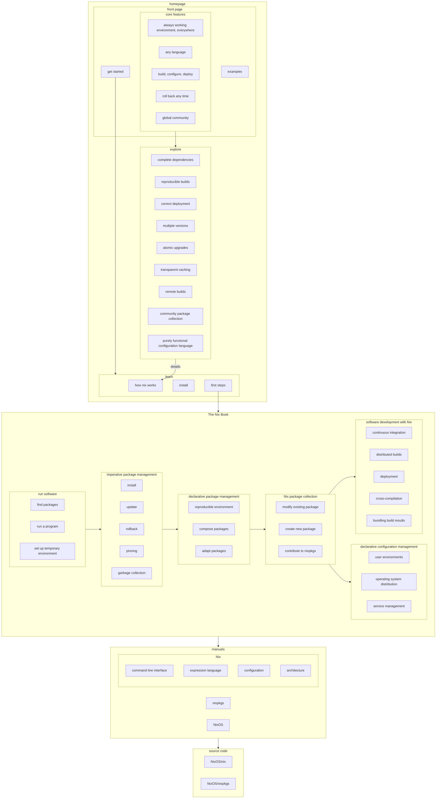

# The Nix Book

This community online learning resource — not a book in the conventional sense — is under development.

It shall offer a centralized autodidactic onboarding path into Nix and its surrounding ecosystem.

By explaing how each component works, how to make best use of it, and how to continue from there, it is supposed to fit between first impressions on the [Nix web site][nixos-org] and the reference manuals for [Nix][nix-manual], [Nixpkgs][nixpkgs-manual], [NixOS][nixos-manual].

[nixos-org]: https://nixos.org
[nix-manual]: https://nixos.org/manual/nix/stable/
[nixpkgs-manual]: https://nixos.org/manual/nixpkgs/stable/
[nixos-manual]: https://nixos.org/manual/nixos/stable/

# Motivation

Nix has a proverbially steep learning curve.

> 
>
> [Posted by nixinator](https://discourse.nixos.org/t/probably-the-best-lecture-of-nix-fundamentals-on-the-internet/9893) on NixOS Discourse

The [Nix](https://nixos.org/manual/nix/stable/)[([pkgs](https://nixos.org/manual/nixpkgs/stable)|[OS](https://nixos.org/manual/nixos/stable/))] manuals, together with the [RFCs](https://github.com/NixOS/rfcs), Eelco Dolstra’s PhD thesis [The Purely Functional Software Deployment Model](https://edolstra.github.io/pubs/phd-thesis.pdf), [NixOS Wiki](https://nixos.wiki/wiki/) and [nix.dev](https://nix.dev), are the most comprehensive collection of knowledge on the design of the Nix ecosystem – except for the code base itself.
But these resources are dispersed, in varying state of maintenance, do not follow a coherent structure to draw an overarching narrative, and, based on rich anecdata, community folklore, and the [2022 Nix survey](https://discourse.nixos.org/t/2022-nix-survey-results/18983), overall are not very effective for onbarding:

> ### Documentation, Documentation, Documentation
>
> Documentation (once again) came up universally across almost all respondents.
  Key asks in this area revolved around three aspects - onboarding, unblocking and centralization.
>
> - Onboarding - A majority of respondents highlighted trouble in the onboarding phase.
    The lack of new user documentation meant users have a tough time understanding how to onboard, following the first few steps, understanding best practices and finding general FAQs.
> - Unblocking - Respondents heavily emphasized the need for better documentation in the realm of tutorials/guides/examples that can help serve in unblocking themselves.
> - Centralization - Many were frustrated with the time it took to locate relevant documentation.
    Searching for answers took too long and invariably led them to various websites, github repos, and videos - often requiring multiple resources to address the same issue.

There also seems to exist no birds-eye view on the larger ecosystem and the interplay of its components.

> 
>
> Own contribution; does not cover topics such as deployment or support tooling.

Meanwhile, complexity is ever growing with new features, and disparity between what is actually explained and what people use in the field continuously increases.

Nix becomes harder to learn every day.

# Project proposal

The high-level goal of this project proposal is to increase community growth by improving the onboarding experience.

## A vision for the journey into Nix, `nixpkgs`, and NixOS

The goal of the following proposal is to make Nix the package manager as well as its sourrounding tools more accessible to Nix beginners, and enabling expert users to become effective contributors or maintainers.

## Write and publish **The Nix Book**

The Nix Book is supposed to be the living, up-to-date overview on all concepts surrounding Nix.

The main target audience are autodidacts who do not have access to hand-holding or personal training, nor possibility for learning through osmosis. It shall contain explanations of technical principles, design rationale, and architecture of all major components in the Nix ecosystem as it is today.

It can mostly be based on available information; reoganized, reworded, or complemented where necessary. See the [proposed outline](#outline) and compare to [current state of documentation](resources.md) for an impression where material can be repurposed. It should be extended with diagrams and illustrations where it would add clarity.

Hypertext allows multiple reading orders through a collection self-contained, but related units. With the right design we can offer multiple coherent access paths into conceptual knowledge; for example breadth-first, depth-first, or free link-surfing.

Ideally there should be usability tests with dedicated or in-line surveys that allow collecting feedback and checking if set learning goals have been met.

## Outline

The book shall be organized top-down from defining a problem domain, the solution approach Nix takes, following explanations how solutions for each specific problems are designed. Each section shall have working examples how to use the presented solution and links to relevant reference manuals.

Each section should have an interactive questionnaire to (at least shallowly) determine learning success and collect feedback.

Sections are ordered from generic to specific. Sections depend on insights from previous chapters, and these dependencies should be made clear, already in the process of developing the book, to further inform a suitable structure or reading order.

Software developers building their own projects may take a different path than end-users who just want to use packaged software temporarily or persistently.

### Which problems Nix solves

- having complete, automatic build instructions
- avoiding dependency hell
- hooking build results into the operating system to make them usable

### How Nix works

Explain high-level architecture, general mechanism, and design rationale of Nix.

- build system
- configuration language
- package manager

@edolstra proposed this to be an appendix. I am convinced a novel paradigm mandates explaining the mechanism first and only then going into details how it applies to specific problems. This chapter should be very concise and make clear the underpinnings, and prominently show diagrams to illustrate the principle. Detailed explanations can follow in chapters on individual subjects.

Also ultimately, in a hypertext document we don't really care about order, and we can always direct the reader by noting what is to be expected from reading a certain chapter.

### What Nix can do

Each section here should start out with a problem description, and explain the mechanism built on top of Nix to solve that problem. Then there should be concrete examples mapping from the explained concepts to interacting with the actual implementation.

- prerequisites
    - install Nix
- build and run software

    Show how existing build plans are used to produce working software.

    - find packaged software
    - run software from existing packages
    - set up a temporary environment
- package management

    This chapter is about how to hold onto the ephemeral examples from the previous chapter, and how to create more complex environments by composing existing packages.

    - imperative package management

        Describes a straightforward transition from temporary environments using existing packages.

        - persist packages in the file system
        - updates, rollbacks, pinning
        - garbage collection

        Imperative package management's unique feature is that it allows updating each package independently to the most recent available version without touching the rest of the system.

    - declarative package management

        While imperative package management supports "generations", it does not have proper change management, "profiles" are not portable, and it is not possible to compose packages into a larger unit.
        This section shows how to have all of that by declaring a Nix expression in a file.

        - declare a reproducible environment
        - compose packages
        - adapt packages to your needs

        This chapter should have at least a reference to or a full-blown copy of a good introduction to the Nix langauge as a prerequisite for working through examples.
        Another option would be to develop an approach to the language by motivating language features through the examples themselves, but that would probably be a lot more work.

- maintain package collection

    Explain how existing packages come into being, how their collection is organized, and show how to modify and create packages.

    - organization of package collection
    - modify existing package
    - create new package
    - contribute to public repository

    Creating packages and contributing are advanced topics that require much more detail (especially langauge specifics), and are partially covered in the `nixpkgs` manual already.
    In this context they are intended to demonstrate `nixpkgs` architecture and design, to enable readers to navigate existing code, assess pull requests, and create or maintain their own packages.
    This should be fairly superficial, otherwise it would duplicate much of the `nixpkgs` manual.
    Alternatively these sections could be dropped entirely, or moved to their own chapter and reference or reuse much of the `nixpkgs` manual.

    Another problem with all of the `nixpkgs` topics is that many design questions are still under debate, and implementation is a moving target, even if slowly.
    It is not yet clear to me how to deal with this, it seems like a lot of work, and possibly `nixpkgs` is entirely out of scope of this book if we cannot gather enough humanpower to sort through all of that.

- declarative configuration management

    Show how the disconnected packages from previous examples can be wired up into a consistent and persistent user environment or operating system configuration.

    - user environments
    - operating system distribution
    - service management

    @thufschmitt correctly pointed out that tools like `home-manager` and `nix-darwin` are not "official" Nix projects. He uttered concern that discussing them in this book in depth may touch a political issue: Do they become "blessed" by including them?

    My stance on this is that they are mature and widely used tools. They should be discussed right next to NixOS already on the principle that they all depend on `nixpkgs` and the way they work is almost identical, illustrating that the mechanism Nix provides is straighforward.

    What is not as clear to me is how to determine if and how alternative contenders should be mentioned. There should be some criteria that makes an alternative approach viable enough to discuss, for example being mature enough to reliably support meaningful examples. Another instance that immediately comes to mind are NixOps and Disnix, both of which (to me) have unclear state of maturity and maintenance, but seem to be developed enough and have interesting concepts that I think are worth including.

- software development
    - continuous integration
    - distributed builds
    - caching
    - deployment
    - cross-compilation
    - bundling build results
        - virtual machines
        - docker containers

## Rework the Nix manual

While the main goal is to fill the explanation gap, gaining an overview, building detailed understanding, collecting and restructuring content is already part of the task. Some of that work could therefore entail overhauling the Nix manual to better fit into the new narrative. Nix the package manager is the core component of the ecosystem and also has the smallest single manual, most amenable to structural change.

- develop a strategy to reposition the manual as purely reference material for Nix the package manager and the Nix expression language
    - place the purpose statement prominently
        - within manual itself
        - in contribution guidelines
    - find new places for material that does not belong any more
    - @edolstra suggests to remove (or adopt in The Nix Book) the following sections
        - Introduction
        - Quick Start
        - Package Management
        - The introductory parts of "Writing Nix Expressions"
        - Glossary
- triage, collect, or document, and keep track of all existing issues
    - conduct, lead, and coordinate attacking the issues by (however determined) priority
    - invite and enable domain experts and volunteers
        - help with merging their contributions
- develop schemes to improve navigation and discoverability
    - links from terms to definitions
    - links to source code

## Improve discoverability of existing learning material

The results of sorting through and reorganizing material for the book can be made available to the general public and already help with onboarding even before the explanations fully materialize.

- collect and correctly categorize
    - similar to or based on [an initial survey of existing resources](resources.md)
    - through the lens of [Backward design](https://en.wikipedia.org/wiki/Backward_design)
        - what are learning objectives and which material achieves which?
- add brief summaries to better orient readers
- rework navigation of learning on [nixos.org][nixos-org] to incorporate the new structure
    - lead readers and contributors to the right places for their types of questions

## How is success defined and measured?

In broad terms, The Nix Book and changes to documentation and web site should measurably increase probability of successful onboarding and decrease time to obtain some well-defined skill set.

Part of the tasks would be to define the learning goals, develop test questions to assess to what degree they were reached, and put up questionnaire forms in each chapter to capture the answers.

Since there are no prior metrics, setting up a preliminary questionnaire should be the first publicly visible part, presented for tutorials on the [learning page](https://nixos.org/learn), [recurring community surveys](https://discourse.nixos.org/t/nix-community-survey-2022-update/18733), and possibly relevant sections of the manuals.

Results should help direct further work, and help answer questions such as:

- Which questions do newcomers ask most, and do they find satisfactory answers consistent with best practice?
- Which material should we add?
- How should we reorganize existing material?
- How should we improve existing material?

As a consequence we should observe influx of new regular users and contributors to `nixpkgs` and, eventually, Nix. We currently cannot measure this. Unfortunately we do not gather community metrics, and this is out of this project's scope.

