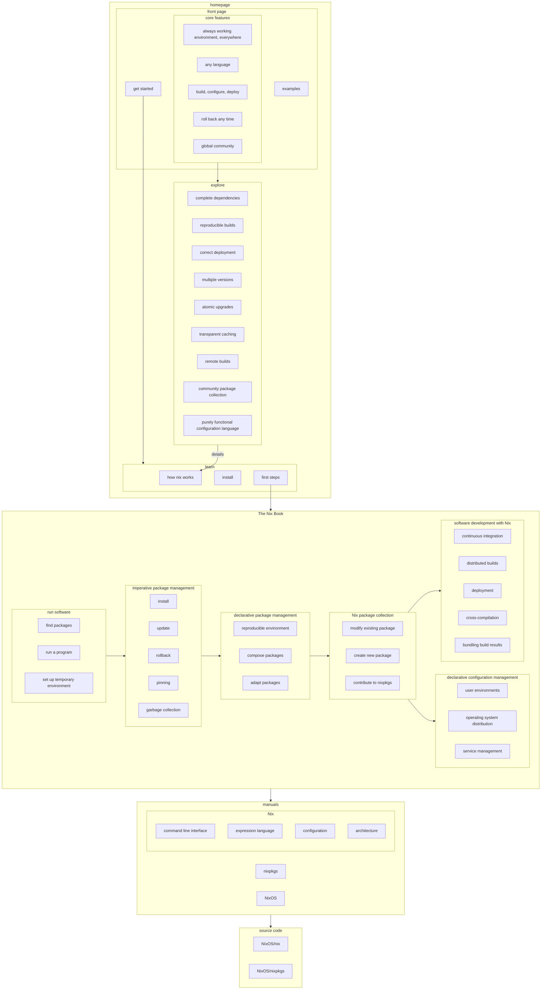

# The Nix Book

This community online learning resource — not a book in the conventional sense — is under development.

It shall offer a centralized autodidactic onboarding path into Nix and its surrounding ecosystem.

By explaing how each component works, how to make best use of it, and how to continue from there, it is supposed to fit between first impressions on the [Nix web site][nixos-org] and the reference manuals for [Nix][nix-manual], [Nixpkgs][nixpkgs-manual], [NixOS][nixos-manual].

[nixos-org]: https://nixos.org
[nix-manual]: https://nixos.org/manual/nix/stable/
[nixpkgs-manual]: https://nixos.org/manual/nixpkgs/stable/
[nixos-manual]: https://nixos.org/manual/nixos/stable/

# Motivation

Nix has a proverbially steep learning curve.

> 
>
> [Posted by nixinator](https://discourse.nixos.org/t/probably-the-best-lecture-of-nix-fundamentals-on-the-internet/9893) on NixOS Discourse

The [Nix](https://nixos.org/manual/nix/stable/)[([pkgs](https://nixos.org/manual/nixpkgs/stable)|[OS](https://nixos.org/manual/nixos/stable/))] manuals, together with the [RFCs](https://github.com/NixOS/rfcs), Eelco Dolstra’s PhD thesis [The Purely Functional Software Deployment Model](https://edolstra.github.io/pubs/phd-thesis.pdf), [NixOS Wiki](https://nixos.wiki/wiki/) and [nix.dev](https://nix.dev), are the most comprehensive collection of knowledge on the design of the Nix ecosystem – except for the code base itself.
But these resources are dispersed, in varying state of maintenance, do not follow a coherent structure to draw an overarching narrative, and, based on rich anecdata, community folklore, and the [2022 Nix survey](https://discourse.nixos.org/t/2022-nix-survey-results/18983), overall are not very effective for onbarding:

> ### Documentation, Documentation, Documentation
>
> Documentation (once again) came up universally across almost all respondents.
  Key asks in this area revolved around three aspects - onboarding, unblocking and centralization.
>
> - Onboarding - A majority of respondents highlighted trouble in the onboarding phase.
    The lack of new user documentation meant users have a tough time understanding how to onboard, following the first few steps, understanding best practices and finding general FAQs.
> - Unblocking - Respondents heavily emphasized the need for better documentation in the realm of tutorials/guides/examples that can help serve in unblocking themselves.
> - Centralization - Many were frustrated with the time it took to locate relevant documentation.
    Searching for answers took too long and invariably led them to various websites, github repos, and videos - often requiring multiple resources to address the same issue.

There also seems to exist no birds-eye view on the larger ecosystem and the interplay of its components.

> 
>
> Own contribution; does not cover topics such as deployment or support tooling.

Meanwhile, complexity is ever growing with new features, and disparity between what is actually explained and what people use in the field continuously increases.

Nix becomes harder to learn every day.

# Project proposal

The high-level goal of this project proposal is to increase community growth by improving the onboarding experience.

## A vision for the journey into Nix, `nixpkgs`, and NixOS

The goal of the following proposal is to make Nix the package manager as well as its sourrounding tools more accessible to Nix beginners, and enabling expert users to become effective contributors or maintainers.

## Write and publish **The Nix Book**

The Nix Book is supposed to be the living, up-to-date overview on all concepts surrounding Nix.

The main target audience are autodidacts who do not have access to hand-holding or personal training, nor possibility for learning through osmosis. It shall contain explanations of technical principles, design rationale, and architecture of all major components in the Nix ecosystem as it is today.

It can mostly be based on available information; reoganized, reworded, or complemented where necessary. See the [proposed outline](src/README.md) and compare to [current state of documentation](resources.md) for an impression where material can be repurposed. It should be extended with diagrams and illustrations where it would add clarity.

Hypertext allows multiple reading orders through a collection self-contained, but related units. With the right design we can offer multiple coherent access paths into conceptual knowledge; for example breadth-first, depth-first, or free link-surfing.

Ideally there should be usability tests with dedicated or in-line surveys that allow collecting feedback and checking if set learning goals have been met.

## Rework the Nix manual

While the main goal is to fill the explanation gap, gaining an overview, building detailed understanding, collecting and restructuring content is already part of the task. Some of that work could therefore entail overhauling the Nix manual to better fit into the new narrative. Nix the package manager is the core component of the ecosystem and also has the smallest single manual, most amenable to structural change.

- develop a strategy to reposition the manual as purely reference material for Nix the package manager and the Nix expression language
    - place the purpose statement prominently
        - within manual itself
        - in contribution guidelines
    - find new places for material that does not belong any more
    - @edolstra suggests to remove (or adopt in The Nix Book) the following sections
        - Introduction
        - Quick Start
        - Package Management
        - The introductory parts of "Writing Nix Expressions"
        - Glossary
- triage, collect, or document, and keep track of all existing issues
    - conduct, lead, and coordinate attacking the issues by (however determined) priority
    - invite and enable domain experts and volunteers
        - help with merging their contributions
- develop schemes to improve navigation and discoverability
    - links from terms to definitions
    - links to source code

## Improve discoverability of existing learning material

The results of sorting through and reorganizing material for the book can be made available to the general public and already help with onboarding even before the explanations fully materialize.

- collect and correctly categorize
    - similar to or based on [an initial survey of existing resources](resources.md)
    - through the lens of [Backward design](https://en.wikipedia.org/wiki/Backward_design)
        - what are learning objectives and which material achieves which?
- add brief summaries to better orient readers
- rework navigation of learning on [nixos.org][nixos-org] to incorporate the new structure
    - lead readers and contributors to the right places for their types of questions

## How is success defined and measured?

In broad terms, The Nix Book and changes to documentation and web site should measurably increase probability of successful onboarding and decrease time to obtain some well-defined skill set.

Part of the tasks would be to define the learning goals, develop test questions to assess to what degree they were reached, and put up questionnaire forms in each chapter to capture the answers.

Since there are no prior metrics, setting up a preliminary questionnaire should be the first publicly visible part, presented for tutorials on the [learning page](https://nixos.org/learn), [recurring community surveys](https://discourse.nixos.org/t/nix-community-survey-2022-update/18733), and possibly relevant sections of the manuals.

Results should help direct further work, and help answer questions such as:

- Which questions do newcomers ask most, and do they find satisfactory answers consistent with best practice?
- Which material should we add?
- How should we reorganize existing material?
- How should we improve existing material?

As a consequence we should observe influx of new regular users and contributors to `nixpkgs` and, eventually, Nix. We currently cannot measure this. Unfortunately we do not gather community metrics, and this is out of this project's scope.

# License and Support

[![License: CC BY-SA 4.0][cc-by-sa-button]][cc-by-sa]
This work is licensed under a [Creative Commons Attribution-ShareAlike 4.0][cc-by-sa] International License.

This project is sponsored by [Tweag][tweag].

[cc-by-sa]: https://creativecommons.org/licenses/by-sa/4.0/
[cc-by-sa-button]: https://licensebuttons.net/l/by-sa/4.0/80x15.png
[tweag]: https://www.tweag.io

